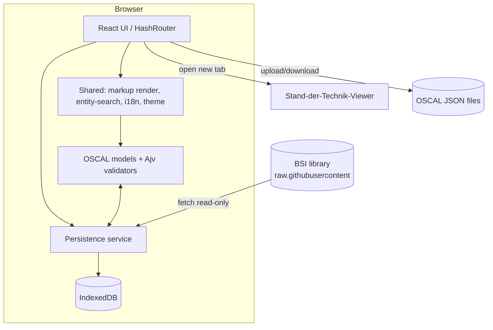

# TALOS — Technical Design

> **TALOS** — Trust and Assessment Lifecycle for Organizational Security.
> A **static, client-side** web app (GitHub Pages) for the OSCAL-based compliance workflow.
> This document is the technical anchor; every decision here traces to an ADR
> (`decision_ids`). See `docs/adr_registry.md`.

**Status:** Draft (pending principal-engineer review, T-017) · **Date:** 2026-07-02

---

## 1. Purpose & scope

TALOS lets users create, edit, and run compliance workflows over OSCAL artifacts entirely in
the browser. Priority capabilities: **component-definitions** and **SSPs**, reachable from a
**landing page**, using OSCAL sources that are either **uploaded** by the user or drawn from the
**BSI Stand-der-Technik-Bibliothek** (read at startup).

**In scope (v1):** landing page; component-definition and SSP CRUD + OSCAL round-trip; profile
CRUD (control tailoring); BSI library browse/adopt; upload/download + workspace export/import;
management dashboard; two assistants. **Deferred:** full editors for assessment-plan /
assessment-results / POA&M (round-trip + read view first, P2); PWA/offline; multi-version OSCAL
conversion; File System Access API.

---

## 2. Architecture overview `[ADR-0002]`

Single-page **React + TypeScript** app built by **Vite** to static assets, deployed to
**GitHub Pages** via GitHub Actions. No backend, no database. Only external network call:
read-only fetch of the BSI library `[ADR-0005]`. User data stays on-device in **IndexedDB**
`[ADR-0004]`.



**Layered structure**

| Layer | Modules | Responsibility |
|---|---|---|
| **UI** | `src/features/*`, `src/app/` (shell, router, landing) | Views, editors, navigation `[ADR-0002,0006]` |
| **Shared** | `src/shared/*` | markup render `[ADR-0009]`, entity-search `[ADR-0013]`, i18n `[ADR-0012]`, theme/tokens `[ADR-0010]`, symbols `[ADR-0011]`, logging |
| **Domain** | `src/models/*` | OSCAL base + per-type models, codecs, Ajv validators `[ADR-0003,0007]` |
| **Data** | `src/data/*` | IndexedDB repositories, file I/O, library loader `[ADR-0004,0005]` |
| **State** | `src/stores/*` (Zustand) | UI/workspace state synced to repositories |

---

## 3. Technology stack & dependencies

| Concern | Choice | Notes |
|---|---|---|
| Language | TypeScript | Strict mode |
| UI | React 18 | Function components + hooks |
| Build | Vite | `base: '/talos/'` for Pages |
| Routing | React Router **HashRouter** | Static-host deep links `[ADR-0002]` |
| State | **Zustand** | Light stores, IndexedDB-synced (Q5) |
| Schema validation | **Ajv** (2020-12) | NIST OSCAL v1.2.2 schemas `[ADR-0003,0007]` |
| Persistence | **IndexedDB** (`idb` wrapper) | `[ADR-0004]` |
| Zip (workspace bundle) | a small zip lib (e.g. `fflate`) | export/import-all (Q8) |
| Markdown | dependency-free renderer (optionally `marked`+`DOMPurify`, constrained) | `[ADR-0009]` |
| Tests | Vitest + React Testing Library; Playwright (E2E); `runner.py` (YAML/golden) | `[ADR-0001]` |

Dependency manifest lives in `package.json` (T-023); Python-side harness deps in
`tests/test_harness/requirements.txt`.

---

## 4. OSCAL data model `[ADR-0003, ADR-0007]`

Shared **`OscalArtifact`** base (`uuid`, `metadata`, `back-matter`) extended per type:
`Profile`, `ComponentDefinition`, `SystemSecurityPlan`, `AssessmentPlan`, `AssessmentResults`,
`PlanOfActionAndMilestones`. See ADR-0003 for the type sketch.

- **Envelope codec:** maps the single-key OSCAL wrapper (`{"component-definition": …}`) ⇄ typed
  model in one place.
- **Shared sub-models & editors:** metadata (roles/parties/props/links/revisions/document-ids),
  back-matter (resources/rlinks/citations), props/links helpers, document-ids (bare-uuid scheme).
- **Validation:** shared envelope validated once; body by the per-type schema. Import + export
  both validate. Authoring/export = **v1.2.2**; import accepts any 1.x with a warning and no
  auto-conversion `[ADR-0007]`.
- **Control references:** IDs resolved to titles when the catalog is cached; full viewing is
  offloaded to the external viewer `[ADR-0008]`.
- **Composition:** component-definitions compose others via `import-component-definition` —
  resolved/unresolved refs, cycle protection, read-only transitive view, back-matter reference
  export `[ADR-0014]`; a core part of the priority component-definition feature (IMPL-001).
- **Fidelity:** unknown-but-spec-allowed fields (props/links/remarks) preserved on round-trip;
  unresolved cross-artifact refs kept verbatim, never dropped `[ADR-0014]`.

---

## 5. Persistence & data flow `[ADR-0004]`

**IndexedDB `talos`** — object stores: `profiles`, `componentDefinitions`, `ssps`,
`assessmentPlans`, `assessmentResults`, `poams`, `libraryCache`, `unresolvedReferences`,
`settings`. Each artifact record carries `origin` (`user` | `imported` | `library`),
`createdAt`, `updatedAt`.

**Flows**
- *Create/edit* → Zustand store → repository `put` → IndexedDB (draft-friendly; validation is
  non-blocking, run on demand + before export, Q6).
- *Upload* → envelope codec + Ajv → store as `origin: imported`; on `uuid` collision **prompt**
  (overwrite / import-as-copy; default copy, Q7).
- *Download* → serialize typed model → OSCAL JSON Blob; filename `<type>-<title-slug>-<uuid8>.json`.
- *Export/Import all* → **zip + `manifest.json`**, each entry standalone OSCAL (Q8).
- *Library* → loader fetches BSI content, caches in `libraryCache` (read-only) `[ADR-0005]`.

**Durability:** request `navigator.storage.persist()`; surface quota via `storage.estimate()`;
on quota error, warn + guide to export, never drop data.

---

## 6. BSI library integration `[ADR-0005, ADR-0008]`

- **Manifest:** committed `public/library-index.json` (built by a maintenance script from the
  GitHub Contents API; CI-regenerated) records `{path, artifactType, title, sha, size}`.
  Default surfaces **Anwenderkataloge** (catalogs) + **Komponenten** (component-definitions);
  **Quellkataloge** behind an "advanced/source" toggle (Q10).
- **Startup:** load the *index* at start; fetch large artifact bodies lazily on open; cache by
  `path`+`sha`. Optional in-app "refresh from GitHub" (live Contents API) (Q11).
- **Provenance:** `origin: library`, read-only, muted-green dashed badge `[ADR-0010]`; **adopt**
  copies into the workspace as `origin: user` with a new `uuid` for tailoring.
- **Catalog viewing:** offloaded to the external Stand-der-Technik-Viewer `[ADR-0008]`.
- **Attribution:** CC-BY-SA-4.0 surfaced in the library browser + README.

---

## 7. UI & navigation `[ADR-0006, ADR-0010, ADR-0011, ADR-0012]`

- **Shell:** HashRouter, top nav, theme toggle (`data-theme`, no media queries), i18n provider
  (**default German**, en available — Q9), toast/error surface.
- **Landing page** `[ADR-0006]`: cards for every feature grouped by OSCAL layer
  (control=blue, implementation=green **[priority: component-defs, SSPs]**, assessment=amber),
  assistants (✦), dashboard, and data (library/upload/export). Cards show per-type artifact
  counts + empty-state guidance.
- **Editors:** hand-built bespoke editors for priority artifacts (Q4), reusing the shared
  metadata/back-matter panels; no generic schema-form dependency.
- **Shared widgets:** markup renderer `[ADR-0009]`, entity-search over IndexedDB `[ADR-0013]`,
  symbol set `[ADR-0011]`.

---

## 8. Error handling, retry & observability `[ADR-0002]`

- **Config validation at startup:** a typed config schema is validated; invalid config fails
  fast with a clear **red** error (T-025).
- **Library fetch:** timeout + limited retry with backoff; degrade to cache with a **yellow**
  warning `[ADR-0005]`.
- **Logging:** structured (JSON-shaped) log records via a logging util, each including
  `decision_ids` (ADR IDs), with an in-app ring buffer for diagnostics; **warnings yellow,
  errors red** in console + toasts.
- **Validation errors:** non-blocking inline validity panel per artifact; blocking only at
  export with an explicit override path.

---

## 9. Security `[ADR-0002, ADR-0009]`

- **XSS:** all OSCAL markup rendered through the single sanitizing renderer (HTML-escape →
  subset → link-URL allowlist); no raw HTML, no images `[ADR-0009]`.
- **Safe parsing:** uploaded JSON parsed defensively + schema-validated before use.
- **External links / hand-off:** `rel="noopener"` new-tab; viewer receives only public URLs.
- **Privacy:** no telemetry, no third-party calls except the read-only BSI fetch; all user data
  on-device.
- Full security notes in `docs/security.md` (T-016); security review T-502.

---

## 10. Performance budgets `[ADR-0002]`

| Metric | Budget (initial target) |
|---|---|
| App shell JS (gzip) | ≤ 250 KB |
| Time-to-interactive (landing, mid device) | ≤ 2.5 s |
| Open a large catalog/component-def render | ≤ 500 ms after fetch |
| IndexedDB list query (typical workspace) | ≤ 50 ms |

Techniques: route-level code splitting, virtualized long lists, memoized markup rendering,
incremental search index. Tracked in `docs/performance.md` (T-016), verified T-503.

---

## 11. Configuration schema `[ADR-0002, ADR-0004]`

Runtime config (build-time env + `settings` store), validated at startup:

```ts
interface TalosConfig {
  basePath: string;                 // Vite base, e.g. "/talos/"
  library: {
    manifestUrl: string;            // public/library-index.json
    rawBase: string;                // raw.githubusercontent base
    liveRefresh: boolean;           // enable GitHub Contents API refresh
    includeSourceCatalogs: boolean; // Quellkataloge toggle default
  };
  viewerUrl: string;                // Stand-der-Technik-Viewer base
  defaultLanguage: 'de' | 'en';     // 'de'
  oscalVersion: '1.2.2';
  backMatter: {
    maxEmbeddedFileBytes: number;   // hard limit for base64-embedded files (default 5 MiB, ADR-0015)
  };
}
```

Invalid config → fail fast, red error, halt boot (T-025).

---

## 12. Testing strategy `[ADR-0001]`

- **Unit/component** (Vitest + RTL): codecs, validators, renderer, search, editors.
- **Golden round-trip:** `import(json) → model → export(json)` deep-equals, per artifact type,
  fixtures in `tests/data/` (incl. sanitized BSI samples with attribution).
- **Contract/schema:** Ajv against vendored NIST v1.2.2 schemas.
- **E2E** (Playwright): landing → adopt-from-library → edit component-def/SSP → download.
- **YAML harness** (`tests/test_harness/runner.py`): executes `tests/tests.yaml`, validates
  golden/schema, emits JSON logs + JUnit XML.
- **CI gate:** full suite blocks the Pages deploy `[ADR-0002]`.

---

## 13. Deployment `[ADR-0002]`

GitHub Actions: `npm ci` → lint + typecheck + **tests (gate)** → `vite build` → deploy `/dist`
to Pages (`actions/deploy-pages`). `404.html` = `index.html` copy for non-hash fallback.

---

## 14. Open design uncertainties

1. **Threat/risk dashboard field** — `controls > props > name:"threats"` (comma-separated threat
   IDs referencing `basethreats.csv` in the BSI namespace folder) is a **coming** BSI feature;
   exact field/namespace **confirmed at implementation** of the Risk-Coverage dashboard (Q12).
2. **External viewer deep-linking** — no per-control URL API today; revisit if the viewer adds
   one `[ADR-0008]`.
3. **Multi-version OSCAL conversion** — deferred; revisit if BSI/user files diverge from 1.2.2
   materially `[ADR-0007]`.
4. **Assistant SSP-bootstrap input format** — asset-list schema/hierarchy mapping to be designed
   with T-301.

---

## 15. Traceability

Every section maps to ADRs (bracketed `decision_ids`) and to `todo.md` tickets; features are
tracked in `docs/feature_registry.yaml` with linked test IDs. Principal-engineer review of this
design + all ADRs is **T-017** (gate before implementation).
